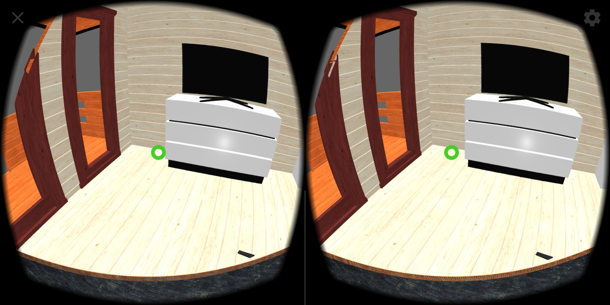
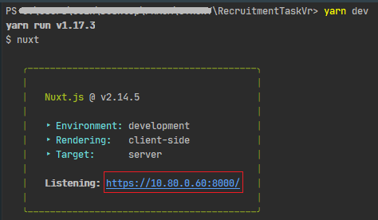

# Zadanie rekrutacyjne

Moduł VR prezentacji produktu - interakcja lokomocyjna `gaze teleportation` w trybie `immersive-vr` (XRSession).
<br><br>

## Informacje wstępne

1. Utwórz *Fork Repository* z dostępem publicznym na podstawie repozytorium podanego poniżej oraz udostępnij nam link
2. Wszystkie zmiany *pushuj* na bieżąco do swojego repozytorium
3. Repozytorium bazowe zawiera przygotowany szkielet frameworka Nuxt.js z dołączoną biblioteką Three.js
4. Docelowa logika aplikacji znajduję się w `/components/js/Scene.init` oraz w `/components/Scene.vue`.

## Wymagania

1. Użycie frameworka *Nuxt.js* i biblioteki *Three.js* 
2. Kod powinien być napisany z zachowaniem nazewnictwa angielskiego 
3. Konto na *github.com*
4. IDE (preferowane *WebStorm*, VSCode)
5. Urządzenie obsługujące `WebXR` i `gaze targetRayMode` (wskazany telefon z systemem Android i żyroskopem)

## Instrukcja konfiguracji środowiska
 
 1. Zainstaluj zależności ```yarn install```
 
 2. Zbuduj wersje deweloperską na _localhost_ ```yarn dev```
 
 3. W obrębie jednej sieci (przypis 1) używając danych wypisanych w konsoli (np. ```https://10.80.0.60:8000```) możesz testować 
 tryb imersywny aplikacji w przeglądarce Chrome na telefonie. <br><br>  <br><br>
 W przypadku gdy adres z poziomu telefonu jest niedostępny można tymczasowo wyłączyć firewall komputera lub dodać do niego regułę.
 
 4. Podepnij telefon do komputera i używając DevTools w przeglądarce Chrome komputera <br>(adres: ```chrome://inspect/#devices```),  
 uzyskaj dostęp do konsoli Chrome w telefonie, w tym celu przeprowadź inspekcje kart przeglądarki telefonu.
 
## Schemat zadania
 

 1. Korzystając z zaimplementowanej klasy `Raycaster`, kolizji obiektów, kontrolera i kamer dla trybu imersywnego stwórz mechanizm
 teleportacji `gaze` pod rozwiązanie Cardboard (telefon).

 2. Warunkiem teleportacji jest utrzymanie kursora przez dany czas (np. 1s) na powierzchni dozwolonego obiektu (przypis 2).
 
 3. Mechanizm ma umożliwiać użytkownikowi poruszanie się po załadowanym modelu w trybie VR.


## Kwestie podlegające ocenie

* Jakość napisanego kodu
* Implementacja optymalnego rozwiązania
* Sposób podejścia do problemu

#### Repozytorium bazowe

```
https://github.com/Digital-Holding/RecruitmentTaskVr
```

#### Przypisy:
1. W obrębie jednej sieci - np. komputer połączony przewodem LAN do routera i telefon połączony do tej samej sieci po Wi-fi
2. Dozwolony obiekt - posiada w nazwie `floor_prefix_` np. floor_prefix_M_AR_changable_exterior

#### W przypadku problemów z konfiguracją środowiska lub zrozumieniem zagadnienia skontaktuj się z nami .
